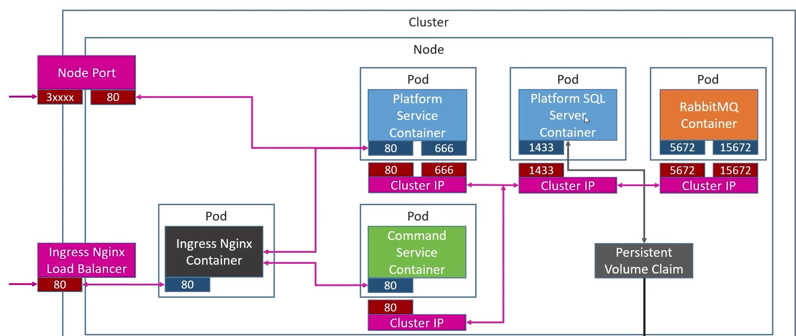

# .Net Microservices

This is .net based microservice project with docker and kubernetes support.

## System Architecture



## Prerequisites
Docker and Kubernetes needs to be installed.


## 🚀 Installation

To download ingress-nginx controller:

```bash
kubectl apply -f https://raw.githubusercontent.com/kubernetes/ingress-nginx/controller-v0.48.1/deploy/static/provider/cloud/deploy.yaml
```

Go To K8S Directory and execute the following commands:

```bash
# To create persistent volume for mssql db
kubectl apply -f local-pvc.yaml 

# To install mssql database and load balancer to use it externally
kubectl apply -f mssql-plat-depl.yaml

# To install rabbitmq
kubectl apply -f rabbitmq-depl.yaml

# To deploy platform service
kubectl apply -f plaforms-depl.yaml

# To deploy commands service
kubectl apply -f commands-depl.yaml

# To create node ports for service
kubectl apply -f platforms-np-srv.yaml

# To create ingress service
kubectl apply -f ingress-srv.yaml
```

## 🤝 Contributing

Pull requests are welcome. For major changes, please open an issue first
to discuss what you would like to change.

## Author

👤 **Tamim Arefin Anik**

- LinkedIn: [@TamimArefinAnik](https://www.linkedin.com/in/tamimarefinanik)

## Show your support ❤️

Please ⭐️ this repository if this project helped you!

## 📝 License

Copyright © 2019 [Tamim Arefin Anik](https://github.com/tamim36).<br />
This project is [MIT](https://choosealicense.com/licenses/mit/) licensed.
